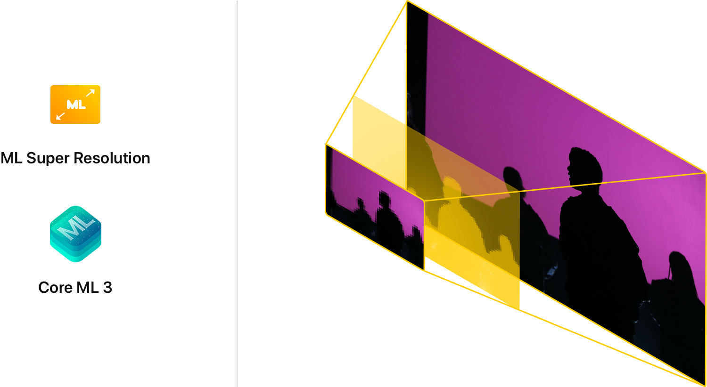

<h1 align="center"><b> SuperResGAN 🔆✨ </b></h1>

<p align="center"></p>


&nbsp;&nbsp;&nbsp;&nbsp;&nbsp;&nbsp;&nbsp;&nbsp;&nbsp;&nbsp;&nbsp;&nbsp;&nbsp;&nbsp;&nbsp;&nbsp;&nbsp;&nbsp;&nbsp;
&nbsp;&nbsp;&nbsp;&nbsp;&nbsp;&nbsp;&nbsp;&nbsp;&nbsp;&nbsp;&nbsp;&nbsp;&nbsp;&nbsp;&nbsp;&nbsp;&nbsp;&nbsp;&nbsp;&nbsp;


[](https://opensource.org/licenses/MIT)


## Background 
The Super-Resolution Generative Adversarial Network (SRGAN) is a seminal work that is capable of generating realistic textures during single image super-resolution. However, the hallucinated details are often accompanied with unpleasant artifacts. To further enhance the visual quality, we thoroughly study three key components of SRGAN - network architecture, adversarial loss and perceptual loss, and improve each of them to derive an Enhanced SRGAN (ESRGAN). In particular, we introduce the Residual-in-Residual Dense Block (RRDB) without batch normalization as the basic network building unit. Moreover, we borrow the idea from relativistic GAN to let the discriminator predict relative realness instead of the absolute value. Finally, we improve the perceptual loss by using the features before activation, which could provide stronger supervision for brightness consistency and texture recovery. 

## Latest Development Changes
```bash
git clone https://github.com/sukkritsharmaofficial/SuperResGAN.git
```

## Download Dependencies
```bash
pip install numpy
pip install opencv-python
pip install torch===1.4.0
pip install torchvision===0.5.0
```

## Code 
#### 1. Importing Dependancies
```python
import os.path as osp
import glob
import cv2
import numpy as np
import torch
import RRDBNet_arch as arch 
```

#### 2. Setting path to the model and test image folder
```python
model_path = 'models/RRDB_ESRGAN_x4.pth'  # models/RRDB_ESRGAN_x4.pth OR models/RRDB_PSNR_x4.pth
device = torch.device('cuda')  # if you want to run on CPU, change 'cuda' -> cpu
test_img_folder = 'LR/*'
```

#### 3. Iterating through all images and converting to desired input format
```python
for path in glob.glob(test_img_folder):
    idx += 1
    base = osp.splitext(osp.basename(path))[0]
    print(idx, base)
    # read images
    img = cv2.imread(path, cv2.IMREAD_COLOR)
    img = img * 1.0 / 255
    img = torch.from_numpy(np.transpose(img[:, :, [2, 1, 0]], (2, 0, 1))).float()
    img_LR = img.unsqueeze(0)
    img_LR = img_LR.to(device)
```
#### 4. Passing the image throught the pretrained model
```python
with torch.no_grad():
        output = model(img_LR).data.squeeze().float().cpu().clamp_(0, 1).numpy()
```

#### 5. Save images to results folder
```python
cv2.imwrite('results/{:s}_rlt.png'.format(base), output)
```

## How to use


Step 1 : Add low resolution images to the folder LR.

Step 2 : Run the following command

```bash
python3 test.py
```
This will iterate through all the photos present in LR folder and save them in results folder.

# To train yourself :fire:✨
Go to [train](https://github.com/sukkritsharmaofficial/SuperResGAN/tree/master/train) and read ReadMe.md
